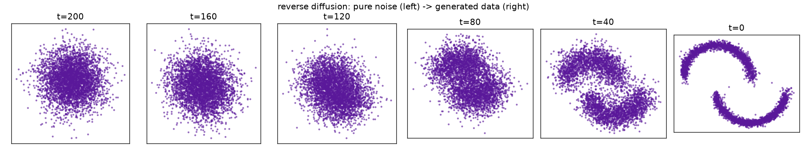
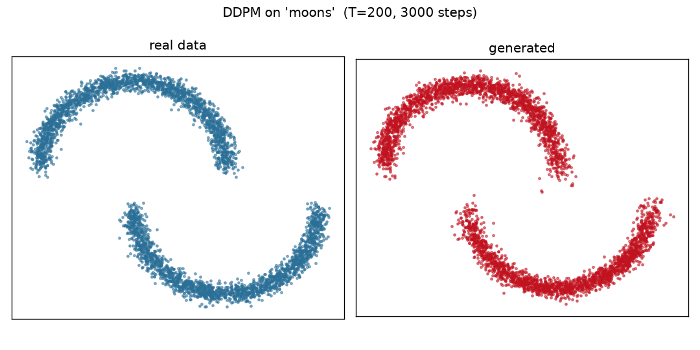
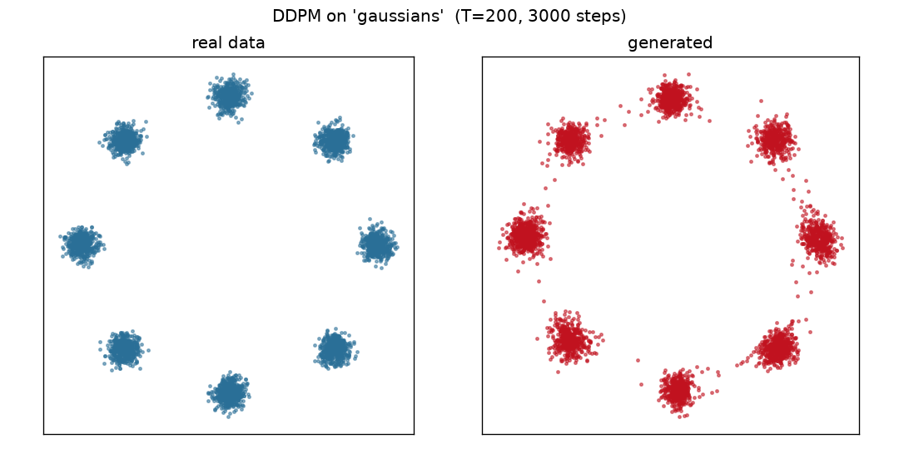

# 04 — Diffusion (DDPM) from scratch

A **Denoising Diffusion Probabilistic Model** (Ho, Jain & Abbeel, 2020) built
from scratch in pure PyTorch, trained on self-contained 2D toy datasets so you
can *see* it work. No datasets to download, no internet, no GPU farm — the whole
thing trains in **~7 seconds on Apple-silicon MPS**.

This is the generative-model entry in the series (after the Transformer, BERT,
and LoRA), and it is deliberately visual: because the data is 2D, we plot real
data next to generated samples and watch pure noise turn into structure.

<p align="center"><em>reverse diffusion: pure noise → generated data</em></p>



---

## The idea in one paragraph

A diffusion model has two processes. The **forward** process is a fixed recipe
that gradually adds Gaussian noise to a real data point over `T` steps until it
is pure noise — nothing is learned here. The **reverse** process is a neural
network that learns to *undo* one step of noising. Once trained, you start from
pure noise and apply the learned denoiser `T` times to generate a brand-new
sample. Training reduces to a single, simple regression: *given a noisy point
and which step it's at, predict the noise that was added.*

## The three equations that matter

**1. Forward jump (closed form).** You never walk the noising chain step by
step. Because each step adds independent Gaussian noise, jumping straight from
the clean point `x₀` to step `t` is itself Gaussian:

```
x_t = √(ᾱ_t) · x₀  +  √(1 − ᾱ_t) · ε ,     ε ~ N(0, I)
```

where `ᾱ_t` (`alpha_bar`) is the cumulative product of `1 − β_i` over the noise
schedule `β`. → `GaussianDiffusion.q_sample` in [diffusion.py](diffusion.py).

**2. Training loss.** Pick a random step `t`, noise `x₀` to `x_t`, and ask the
network `ε_θ` to predict the noise. That's it:

```
L = ‖ ε  −  ε_θ(x_t, t) ‖²
```

→ `GaussianDiffusion.p_losses`.

**3. Reverse step (sampling).** Using the predicted noise, the mean of the
previous, less-noisy point has a closed form; add a little noise except at the
final step:

```
x_{t-1} = 1/√(α_t) · ( x_t − β_t/√(1−ᾱ_t) · ε_θ(x_t, t) )  +  √(β_t) · z
```

→ `GaussianDiffusion.p_sample` and `.sample`.

## Files

| file | what it is |
|------|-----------|
| [data.py](data.py) | Four self-contained 2D datasets (`moons`, `spiral`, `gaussians`, `checkerboard`), generated with numpy. No downloads. |
| [diffusion.py](diffusion.py) | The DDPM math from scratch: noise schedule, forward jump, training loss, reverse sampling. **Read this first.** |
| [model.py](model.py) | The denoiser: a small residual MLP with a sinusoidal timestep embedding (same idea as the Transformer's positional encoding). |
| [train.py](train.py) | Training loop; saves weights + a loss curve + a real-vs-generated scatter. |
| [sample.py](sample.py) | Loads trained weights and generates samples; `--trajectory` saves the noise→data snapshots above. |
| [viz.py](viz.py) | Plotting (matplotlib, with a zero-dependency SVG fallback). |

## Run it

```bash
cd 04-diffusion
# train on the two-moons dataset (default) — ~7s on MPS
.venv/bin/python train.py --dataset moons

# other shapes
.venv/bin/python train.py --dataset gaussians    # 8 blobs — tests mode coverage
.venv/bin/python train.py --dataset spiral
.venv/bin/python train.py --dataset checkerboard

# generate more samples + the noise->data trajectory from saved weights
.venv/bin/python sample.py --dataset moons --trajectory
```

Outputs land in `outputs/<dataset>/`: `model.pt`, `loss.png`, `samples.png`,
and (from `sample.py`) `generated.png`, `trajectory.png`.

Useful flags: `--steps`, `--timesteps` (T), `--batch`, `--lr`, `--hidden`,
`--blocks`, `--seed`, `--device {auto,mps,cpu,cuda}`. Everything is seeded, so
runs are reproducible.

## Results

Two moons — the generated cloud reproduces both arcs and the gap:



Eight Gaussians — all eight modes are covered (no mode collapse):



## Things to notice / exercises

- **The loss does not go to zero**, and it shouldn't. The target `ε` is fresh
  random noise; much of it is unpredictable from `x_t` alone. A loss that
  plateaus around a constant is expected — judge the model by its *samples*, not
  its loss.
- **Faint points between the 8 Gaussians.** DDPM ancestral sampling leaves a
  little probability mass on the paths between well-separated modes. Try raising
  `--timesteps` to 400 or training longer and watch it tighten.
- **Exercise:** implement the faster **DDIM** deterministic sampler (skip steps)
  and compare sample quality vs. number of steps.
- **Exercise:** swap the ε-prediction target for **x₀-prediction** and adjust
  `p_sample` accordingly — a common alternative parameterization.
- **Exercise:** the `SinusoidalTimeEmbedding` is the Transformer's positional
  encoding wearing a different hat. Re-read `model.py` next to `01-transformer`.
